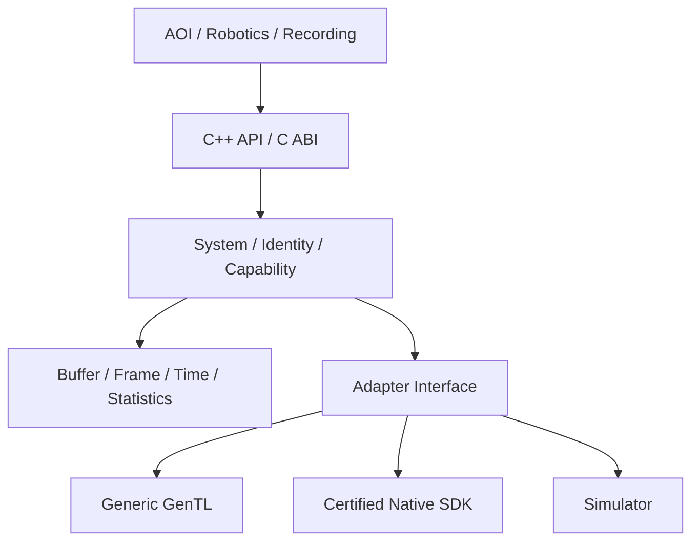

# UniVision 基础架构

## 运行时边界

Core 不直接包含任何厂商头文件。每个真实 Adapter 负责将厂商错误、生命周期、Feature 和 Buffer 转换为 UniVision 公共模型。

## 对象与生命周期

| 对象 | 职责 | 关键约束 |
|---|---|---|
| `System` | Adapter 注册、设备枚举、去重和选择 | Adapter 调用不在注册锁内执行 |
| `Adapter` | 一个 Producer 或厂商 SDK 的边界 | ID 唯一；返回统一 `DeviceInfo` |
| `Camera` | 打开、关闭、恢复和 Feature | 状态机显式；创建流前必须打开 |
| `Stream` | 采集启动、等待帧和统计 | 背压策略显式配置 |
| `Frame` | 描述符、Buffer 与 Chunk Metadata | Buffer 所有权随 Frame，禁止隐式像素转换 |

## 设备身份与 Adapter 选择

Adapter 应尽可能给出跨枚举稳定的 `stable_id`。真实相机建议由 transport identifier、MAC/serial、vendor/model 组合生成。多个 Adapter 报告相同 `stable_id` 时，Core 只保留最高优先级入口。

建议优先级顺序：

1. 已认证 Native Adapter；
2. 已认证 GenTL Producer；
3. Generic GenTL 或 Aravis best-effort；
4. 不支持。

## ABI 策略

公共 C++ API 用于本地集成，`include/univision/c/univision.h` 是语言绑定的稳定底座。C 结构首字段是 `struct_size`，允许未来在尾部追加字段。跨 ABI 边界不传递 STL 对象或异常；帧通过 opaque handle 持有 Buffer 生命周期。

基础版本先稳定应用侧 C ABI。动态 Adapter 插件 ABI 会在 Generic GenTL 路径跑通并明确隔离要求后冻结，避免过早固化错误的 Buffer/事件语义。

## 线程与错误模型

`System` 的 Adapter 注册表受互斥锁保护，枚举前复制快照，避免执行外部 SDK 代码时持锁。每个 Adapter 必须声明并内部满足其厂商 SDK 的线程限制。

可预期失败通过 `Status`/`Result<T>` 返回；Adapter 不允许让厂商异常越过公共边界。C ABI 另提供线程局部 `uv_last_error_message()`，返回最近一次调用的诊断文本。
